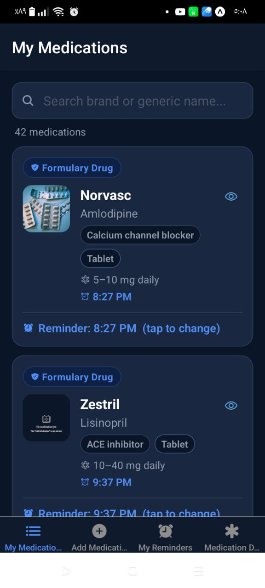

# My Medications App

A comprehensive medication management app built with React Native and Expo, designed to help users track their medications, set reminders, and manage their health effectively.

## 🏠 Home Page



_The home page displays all your medications in a clean, organized interface with quick access to search and medication details._

## ✨ Features

- **📋 Medication Management**: Add, edit, and delete medications with detailed information
- **⏰ Smart Reminders**: Set customizable reminders for medication intake
- **🔍 Quick Search**: Find medications quickly with the built-in search functionality
- **📱 Beautiful UI**: Modern, intuitive interface with smooth animations
- **💾 Local Storage**: All data stored locally on your device for privacy
- **🎨 Dark Theme**: Easy on the eyes dark blue theme design

## 🛠 Tech Stack

- **React Native** - Cross-platform mobile development
- **Expo** - Development platform and toolchain
- **TypeScript** - Type-safe JavaScript
- **Expo Router** - File-based routing
- **SQLite** - Local database storage
- **Expo Notifications** - Push notifications for reminders

## 📱 Screens

- **My Medications**: Home screen showing all medications
- **Add Medication**: Form to add new medications
- **Medication Details**: Detailed view of individual medications
- **My Reminders**: Manage and view all medication reminders

## 🚀 Getting Started

### Prerequisites

- Node.js (v18 or higher)
- npm or yarn
- Expo Go app on your device (for testing)

### Installation

1. Clone the repository:

```bash
git clone <repository-url>
cd medical-project
```

2. Install dependencies:

```bash
npm install
```

3. Start the development server:

```bash
npm start
```

4. Scan the QR code with Expo Go app on your device

### Available Scripts

- `npm start` - Start the development server
- `npm run android` - Run on Android device/emulator
- `npm run ios` - Run on iOS device/simulator
- `npm run web` - Run in web browser
- `npm run lint` - Run ESLint

## 📁 Project Structure

```
medical-project/
├── app/                    # App screens and routing
│   ├── (tabs)/            # Tab navigation screens
│   └── _layout.tsx        # Root layout
├── components/            # Reusable UI components
├── constants/             # App constants and configurations
├── context/              # React context providers
├── database/             # Database configuration and queries
├── hooks/                # Custom React hooks
├── services/             # API and external services
└── assets/               # Static assets
```

## 🎯 Key Components

- **TabLayout**: Main navigation with bottom tabs
- **MedicationList**: Displays all medications
- **MedicationForm**: Add/edit medication form
- **ReminderManager**: Handles medication reminders
- **SearchBar**: Quick medication search functionality

## 🔧 Configuration

The app uses Expo configuration files:

- `app.json` - Main Expo configuration
- `eas.json` - Expo Application Services configuration
- `tsconfig.json` - TypeScript configuration

## 📱 Platform Support

- ✅ iOS
- ✅ Android
- ✅ Web (limited functionality)

## 🤝 Contributing

1. Fork the repository
2. Create a feature branch (`git checkout -b feature/amazing-feature`)
3. Commit your changes (`git commit -m 'Add amazing feature'`)
4. Push to the branch (`git push origin feature/amazing-feature`)
5. Open a Pull Request

## 📄 License

This project is licensed under the MIT License - see the LICENSE file for details.

## 📞 Support

For support and questions, please open an issue in the repository.

---

Built with ❤️ using React Native and Expo
